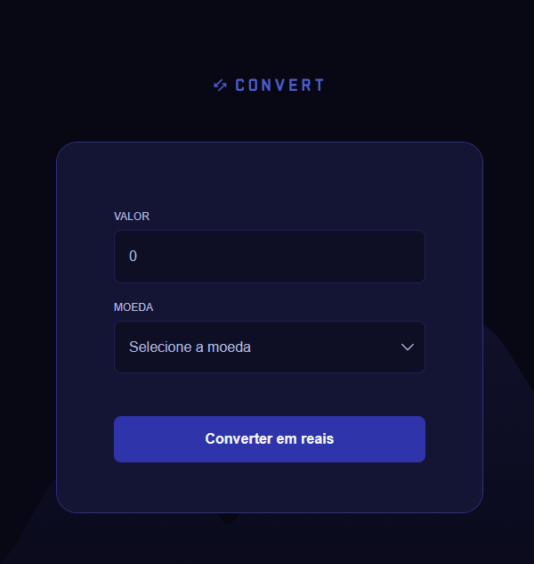
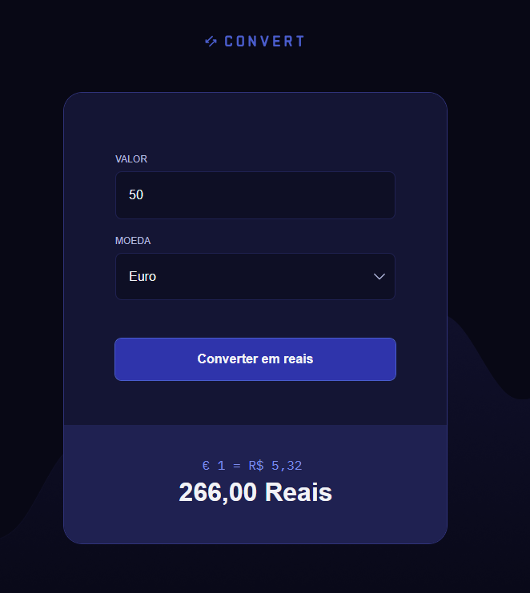

# Conversor de Moedas 💱

## Overview ⭐

Este projeto mostra um conversor de moedas para Reais, foi desenvolvido utilizando conceitos de JavaScript, também foi utilizado Expressão regular para evitar erros de digitação do usuário.

## Technologies used 🧩

## About the development 🛠️

O projeto foi desenvolvido junto ao professor para praticarmos os conceitos do JavaScript.

## Features ✅

- Evita erros de digitação: O input aceita apenas números, utilizando técnica de Regex.
- Footer dinâmico: O footer aparece apenas quando o formulário é enviado.

## Showcase 💻

